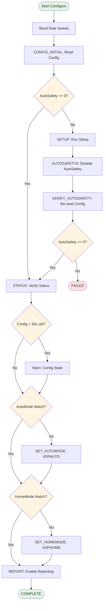

# ros2_roamadome

A ROS2 hardware interface for the [Roam-A-Dome](https://github.com/reeltwo/DomeControlFirmware) controller, which manages dome positioning for R2-D2 models and similar projects.

## Overview

This package provides a ROS2 control hardware interface that integrates with the Roam-A-Dome controller firmware. It exposes the dome joint through standard ROS2 hardware interfaces, allowing controllers and motion planning nodes to command and monitor dome position and velocity.

### Key Features

- **Hardware Interface**: Implements `ActuatorInterface` for ROS2 control framework
- **Startup State Machine**: Configure lifecycle uses a read-driven command/probe sequence
- **State Interfaces**: Exposes dome joint position and velocity feedback
- **Command Interfaces**: Accepts position and velocity commands for dome movement
- **Pluginlib-based**: Loadable as a ROS2 controller plugin

## Hardware Background

The [Roam-A-Dome](https://github.com/reeltwo/DomeControlFirmware) (RDH) is an Arduino-based controller board for dome positioning systems. It supports:

- **Multiple Board Variants**: Arduino Mega, ESP32, ESP32S2, ESP32S3 with optional LCD displays
- **Controls**: Motor speed, acceleration/deceleration ramping, homing, and autonomous movement modes
- **Communication**: 
  - Serial packet protocol for command/control
  - PWM input/output support
  - WiFi support (ESP32 variants)
  - Droid Remote support for app-based control
- **Positioning**: Absolute and relative dome rotation with configurable speed profiles

For complete hardware documentation, see the [DomeControlFirmware repository](https://github.com/reeltwo/DomeControlFirmware).

## Package Structure

```
ros2_roamadome/
├── src/
│   ├── roamadome_control.cpp      # Hardware interface implementation
│   └── roamadome_control_node.cpp # Standalone node (if applicable)
├── include/ros2_roamadome/
│   ├── roamadome_control.hpp      # Hardware interface header
│   └── visibility_control.h       # Symbol visibility macros
├── robot_hardware.xml             # Hardware interface plugin description
├── CMakeLists.txt
├── package.xml
└── README.md
```

## Interfaces

### State Interfaces

The controller exports the following state interfaces for the `dome_joint`:

| Interface | Description |
|-----------|-------------|
| `dome_joint/position` | Current dome position in radians (0-2π) |
| `dome_joint/velocity` | Current dome angular velocity in rad/s (currently 0.0 unless device velocity feedback is added) |

### Command Interfaces

The controller accepts the following command interfaces for the `dome_joint`:

| Interface | Description |
|-----------|-------------|
| `dome_joint/position` | Desired dome position in radians |
| `dome_joint/velocity` | Desired dome angular velocity in rad/s |

## Dependencies

- **ROS2 Dependencies**:
  - `hardware_interface`: Hardware abstraction layer
  - `controller_manager`: Manages lifecycle and plugins
  - `pluginlib`: Dynamic plugin loading
  - `rclcpp`: C++ ROS2 client library

## Building

Build the package using `colcon`:

```bash
cd ~/r2_ws
colcon build --packages-select ros2_roamadome
```

## Usage

### Hardware Configuration

To use this hardware interface, include it in your ROS2 hardware configuration URDF or YAML file. The hardware interface will be loaded by the controller manager as a pluginlib plugin.

Example configuration:

```yaml
hardware:
  - name: roamadome_control
    type: ros2_roamadome/RoamadomeControl
```

### Launching Controllers

Once the hardware interface is loaded, you can load controllers (e.g., a position controller) that interact with the dome joint:

```bash
ros2 control load_controller dome_position_controller
ros2 control set_controller_state dome_position_controller active
```

### Commanding the Dome

Commands can be published to controller topics or issued via the controller manager interface.

## Setting up the Hardware Device

Before using this interface:

1. **Program the Roam-A-Dome**: Program the controller board with the DomeControlFirmware
2. **Serial Configuration**: Configure via serial commands (see firmware documentation)
3. **Homing**: Perform initial homing calibration either via serial, LCD menu, or hardware setup
4. **Connection**: Establish serial communication from ROS2 host to the controller

For detailed hardware setup instructions, see the [DomeControlFirmware README](https://github.com/reeltwo/DomeControlFirmware#readme).

## Serial Protocol

This interface communicates with the hardware via the Roam-A-Dome serial protocol.

### Configuration Parameters

The following parameters can be specified in your URDF/XACRO hardware description:

| Parameter | Type | Default | Description |
|-----------|------|---------|-------------|
| `serial_port` | string | *required* | Serial port device path (e.g., `/dev/ttyACM0`) |
| `serial_baud` | uint32 | `115200` | Serial baud rate |
| `max_speed_rad_per_sec` | double | `3.14` | Maximum dome angular velocity in rad/s (~180°/s) |
| `auto_mode` | bool | `false` | Enable AutoMode on device during startup |
| `home_mode` | bool | `false` | Enable HomeMode on device during startup |
| `startup_log_level` | string | `debug` | Log level for startup transitions (`debug` or `info`) |
| `startup_default_timeout_ms` | uint32 | `1000` | Default timeout for startup commands (ms) |
| `startup_setup_timeout_ms` | uint32 | `10000` | Timeout for `#DPSETUP` command (ms) |
| `startup_report_timeout_ms` | uint32 | `1000` | Timeout for `#DPREPORT` command (ms) |
| `startup_retries` | uint32 | `1` | Number of retries for timed-out startup commands |
| `startup_config_stale_warning_ms` | uint32 | `30000` | Warning threshold for stale configuration data (ms) |

**Example URDF Configuration:**

```xml
<ros2_control name="roamadome_system" type="system">
  <hardware>
    <plugin>ros2_roamadome/RoamadomeControl</plugin>
    <param name="serial_port">/dev/ttyACM0</param>
    <param name="serial_baud">115200</param>
    <param name="max_speed_rad_per_sec">3.14</param>
    <param name="auto_mode">true</param>
    <param name="home_mode">false</param>
    <param name="startup_log_level">info</param>
  </hardware>
  <joint name="dome_joint">
    <command_interface name="position"/>
    <command_interface name="velocity"/>
    <state_interface name="position"/>
    <state_interface name="velocity"/>
  </joint>
</ros2_control>
```

**Note on Logging Levels:**
- `startup_log_level=debug`: Startup transition logs only appear when running with `--ros-args --log-level debug`
- `startup_log_level=info`: Startup transition logs always appear at default log level

### Startup Configure Sequence

During `on_configure()`, the hardware interface performs a deterministic startup sequence to ensure the device is properly configured:



**Startup Phases:**

1. **Baud Rate Sweep**: Iterate through supported baud rates (`2400`, `9600`, `19200`, `38400`, `115200`) and send `#DPSERIALBAUD<target>` at each rate. This is a best-effort step with no explicit completion check.

2. **CONFIG_INITIAL**: Read the device configuration using `#DPCONFIG`. If `AutoSafety` is already `0`, skip to STATUS. Otherwise, proceed to SETUP.

3. **SETUP → AUTOSAFETY0 → VERIFY_AUTOSAFETY** (conditional): If AutoSafety was enabled:
   - Run `#DPSETUP` (10-second timeout for mechanical homing)
   - Send `#DPAUTOSAFETY0` to disable auto safety
   - Re-read config with `#DPCONFIG` to verify `AutoSafety == 0`
   - If verification fails, startup fails with error

4. **STATUS**: Run `#DPSTATUS` to verify auto safety is disabled in device status

5. **Configuration Staleness Check**: If the configuration data is older than the threshold (default 30 seconds, configurable via `startup_config_stale_warning_ms`), log a warning. This can catch firmware communication issues.

6. **AutoMode/HomeMode Configuration**: Check if device AutoMode and HomeMode match desired states from URDF parameters:
   - If `auto_mode=true` but device `AutoMode != 1`, send `#DPAUTO1`
   - If `auto_mode=false` but device `AutoMode != 0`, send `#DPAUTO0`
   - If `home_mode=true` but device `HomeMode != 1`, send `#DPHOME1`
   - If `home_mode=false` but device `HomeMode != 0`, send `#DPHOME0`

7. **REPORT**: Enable periodic position reporting with `#DPREPORT<ms>`, where `<ms>` is calculated from the controller read/write rate

**Command Probe Pattern:**

Each startup command is followed by `#DPINVALID` as a completion probe. The device processes commands sequentially, so probe completion requires reading both:
- `PROCESS: "#DPINVALID"`
- `Invalid`

This ensures the previous command has been fully processed before proceeding.

**Timeouts and Retries:**

Each wait state performs serial reads in a loop with configurable timeouts:
- `startup_default_timeout_ms`: Default timeout for most commands (default: 1000ms)
- `startup_setup_timeout_ms`: Extended timeout for `#DPSETUP` due to mechanical homing (default: 10000ms)
- `startup_report_timeout_ms`: Timeout for `#DPREPORT` command (default: 1000ms)
- `startup_retries`: Number of retry attempts for timed-out commands (default: 1)

**Special Behaviors:**

- When `#DPSETUP` output contains `GOOD MAX SPEED: <n>`, the value is parsed and stored for potential future use
- Transitions are data-driven from a startup command table with conditional branching via lambda functions
- Configuration data includes a timestamp to detect stale data (warns if older than `startup_config_stale_warning_ms`, default 30 seconds)

### Command Terminators

`RoamadomeSerialPort::sendCommand()` appends a newline terminator by default when missing. Pass `append_terminator=false` for raw writes.

### Common Runtime Commands

Common commands:

- `:DPA<degrees>` - Rotate dome to absolute position (0-359°)
- `:DPH` - Return dome to home position
- `:DPR<speed>` - Rotate dome continuously
- `:DPS<number>` - Play stored sequence

For a complete list of commands and configuration options, refer to the [hardware documentation](https://github.com/reeltwo/DomeControlFirmware#serial-configuration-commands).

## Development Notes

- Startup configuration uses a deterministic state machine to sequence status/config/report setup.
- Position wraps around at 2π radians (360°).
- Velocity state feedback is currently exported but not computed from hardware feedback yet.
- Read/write cycle timing is managed by the ROS2 controller manager.

## Testing

Run package tests with:

```bash
cd ~/r2_ws
colcon test --packages-select ros2_roamadome
colcon test-result --verbose
```

Current tests include serial parser behavior, command terminator behavior, and configure-state-machine startup coverage.

## License

This package is part of the R2 robotics project. See your repository's LICENSE file for details.

## Additional Resources

- [ROS2 Hardware Interfaces](https://docs.ros.org/en/rolling/Concepts/Advanced/Hardware-Acceleration/Overview-of-hardware-interfaces.html)
- [Roam-A-Dome Firmware (GitHub)](https://github.com/reeltwo/DomeControlFirmware)
- [ROS2 Control Framework](https://control.ros.org/)

## Support

For issues related to:
- **ROS2 Integration**: Check ROS2 control framework documentation
- **Hardware Firmware**: See [DomeControlFirmware Issues](https://github.com/reeltwo/DomeControlFirmware/issues)
- **This Package**: Check the main R2 project repository
